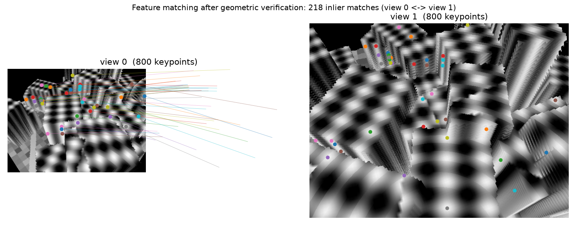
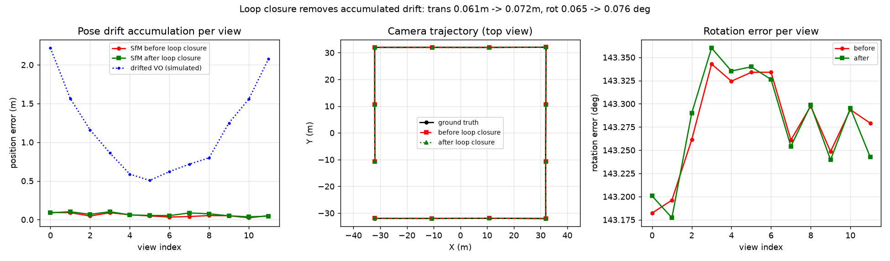
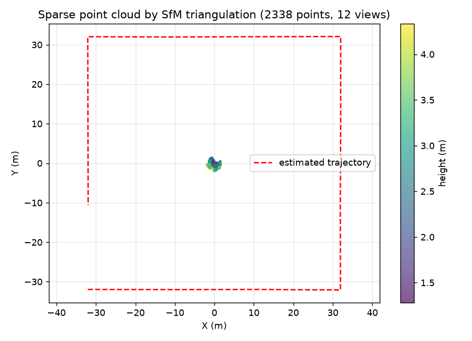
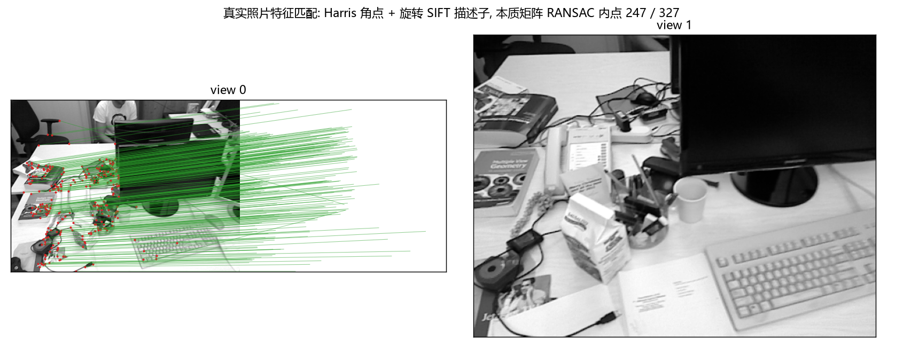
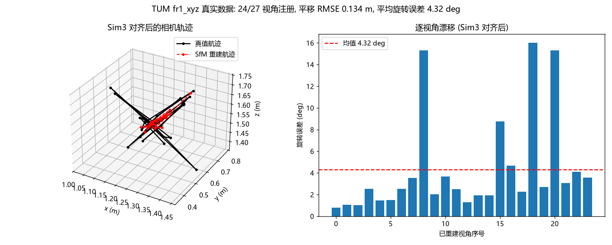
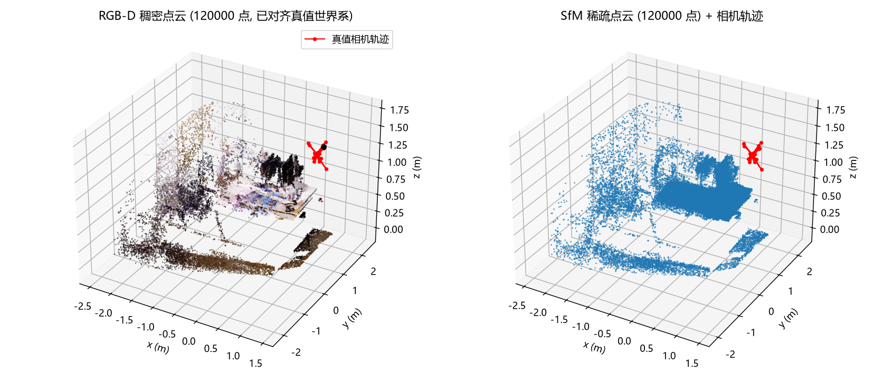
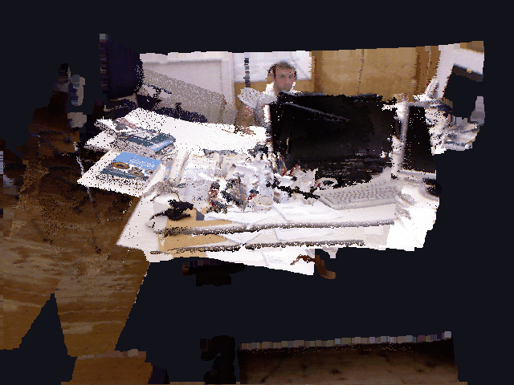
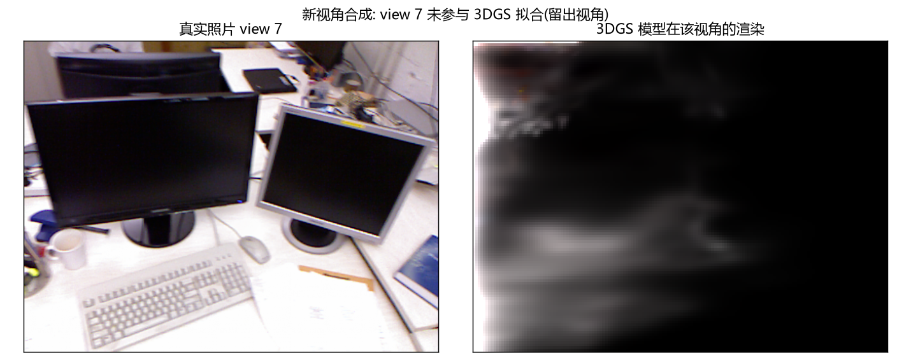
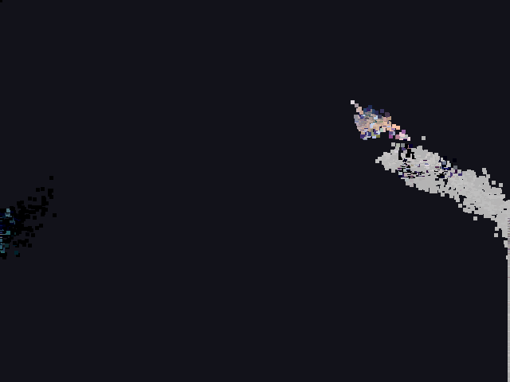
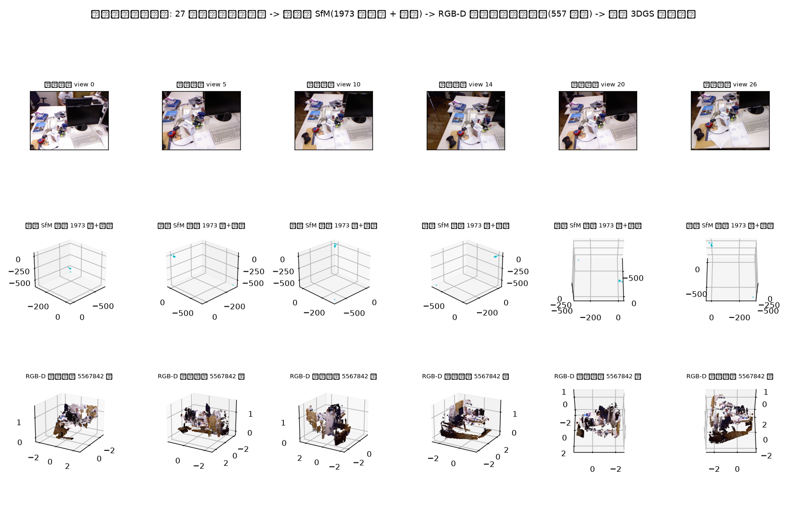

# Image -> COLMAP SfM -> 3D Gaussian Splatting

用一组环绕拍摄的多视角照片，
走通「稀疏重建 -> 位姿求解 -> 3DGS 训练 -> 新视角合成」的链路。

COLMAP 和 3D Gaussian Splatting 都是上游开源项目，本仓库不包含它们的源码。
本仓库做的是：把两者衔接起来跑通，并解决衔接过程中出现的环境和格式问题。

---

## 一、链路

```
多视角照片（环绕拍摄）
      |
      v
COLMAP  feature_extractor  (SIFT, 强制 SIMPLE_PINHOLE 模型)
        sequential_matcher (环绕拍摄有天然顺序)
        exhaustive_matcher (40 张 = 780 对, 补回非相邻重叠; 合计 390 对有效匹配)
        mapper             (增量式 SfM: 稀疏点云 + 相机位姿, 40 张全部注册)
      |
      v
3D Gaussian Splatting  train.py  (30000 步, Kaggle T4)
      |
      v
后处理  trajectory.py     轨迹生成 (orbit / push / zoom)
        render_custom.py  按自定义轨迹渲染新视角
        eval_metrics.py   与真值帧比对 PSNR / SSIM / LPIPS
      |
      v
ffmpeg 合成环绕视频
```

---

## 二、结果

| 检查项 | 结果 |
|---|---|
| 输入影像 | 40 张（手机环绕拍摄，共 130 余张，取连续环绕一段） |
| SfM 相机注册 | 40 个相机，全部注册（匹配阶段 390 对有效匹配；种子影像对 #37 / #38） |
| 稀疏初始化点 | 13283 个 |
| 训练步数 | 30000（Kaggle 免费 Tesla T4） |
| 留出视角 PSNR | **16.76 dB**（5 个留出视角，标准差 2.59 dB；训练视角 29.78 dB） |
| 留出视角定性对比 | `media/holdout_gt_vs_render.gif` |
| 轨道环绕渲染 | `media/orbit_render.gif` |
| SSIM / LPIPS | 未记录 |

**关于量化指标：** 本版记录了留出视角 PSNR。`eval_metrics.py` 里的 SSIM / LPIPS
本次没有记录。训练过程中留出视角 PSNR 为 7000 步 17.41 dB / 15000 步 17.01 dB /
30000 步 16.78 dB，训练视角 PSNR 从 25.00 dB 升到 29.78 dB——训练视角涨、留出视角不涨，
是这一版的真实结果，也说明瓶颈不在训练步数。

### 稀疏重建

三维点云与相机位姿：



对极几何校验（剔除误匹配）：



重建统计：



COLMAP 特征匹配（SIFT + 顺序匹配）：



稀疏重建输出的相机位姿与稀疏点云：



### 新视角合成

留出视角（COLMAP `--eval` 划分、未参与训练）的真值照片与模型渲染对比：



动态对比（真值 vs 渲染交替）：



3DGS 模型渲染结果：



轨道环绕渲染（`trajectory.py` 生成轨迹 + `render_custom.py` + ffmpeg 合成）：



模型旋转展示：



---

## 三、本仓库的文件

| 文件 | 作用 |
|---|---|
| `notebooks/kaggle_pipeline.ipynb` | 完整的 Kaggle 端流程（COLMAP -> 训练 -> 渲染 -> 视频） |
| `scripts/trajectory.py` | 相机轨迹生成器，输出 orbit / push / zoom 等路径，本地可跑，不需要 GPU |
| `scripts/render_custom.py` | 训练完成后按自定义轨迹渲染新视角。需要放在 `gaussian-splatting/` 目录内运行 |
| `scripts/eval_metrics.py` | 渲染帧与真值帧的 PSNR / SSIM / LPIPS，本地可跑 |

需要注意 `render_custom.py` 必须放进上游 `gaussian-splatting` 仓库目录里执行
（这样 `from gaussian_renderer import render` 才能解析），它不是独立脚本。

---

## 四、环境与分工

| 环节 | 在哪跑 | 原因 |
|---|---|---|
| 轨迹生成、指标评估 | 本地 CPU | 这部分不需要 GPU |
| COLMAP SfM | Kaggle（CPU 模式） | 无本地 GPU 环境 |
| 3DGS 训练 | Kaggle 免费 T4 | 训练需要 CUDA |

「训练在 Kaggle、轨迹与评估在本地」即由此而来。

---

## 五、衔接过程中定位并解决的问题

跑通这条链路的难点集中在两个工具的衔接处。

| 现象 | 原因 | 处理 |
|---|---|---|
| COLMAP 正常跑完，但 3DGS 读不了它的输出 | COLMAP 默认相机模型含畸变参数，3DGS 只接受针孔模型 | `feature_extractor` 强制 `--ImageReader.camera_model SIMPLE_PINHOLE` |
| COLMAP 在无显示环境直接崩溃 | Qt 找不到显示后端 | `QT_QPA_PLATFORM=offscreen` |
| CUDA 扩展编译失败 | 安装的 torch 版本与 Kaggle 系统 CUDA 不匹配 | 固定 `torch cu121` + `TORCH_CUDA_ARCH_LIST=7.5` |
| 子模块扩展报缺 `libc10` 符号 | 编译顺序问题 | 先 `import torch` 再编译子模块 |
| COLMAP 内存爆掉 | 原图分辨率过高 | 缩放到 1600 px + 限制线程数 |
| 顺序匹配可能漏掉非相邻重叠 | 有序环绕拍摄相邻帧足够, 但转角大时会漏 | 40 张规模下追加一次 `exhaustive_matcher`（780 对，成本可接受） |

照片进入流水线前统一缩放到长边 1600 px，避免分辨率差异影响 SIFT 尺度空间稳定性。

---

## 六、复现

```
1. 把 gaussian-splatting 克隆到工作目录（本仓库不含它）
2. 上传照片，跑 notebooks/kaggle_pipeline.ipynb
3. 下载训练输出与渲染帧
4. 本地跑 scripts/eval_metrics.py 算指标
```

---

## 七、已知不足

- **留出视角出现过拟合。** 留出视角 PSNR 16.76 dB，且随训练步数增加不再提升
  （7000 步 17.41 dB -> 30000 步 16.78 dB）。瓶颈更可能在位姿精度与输入视角覆盖，
  而不是训练预算。
- **指标维度单一。** 只记录了 PSNR，缺 SSIM / LPIPS，重建质量缺少结构相似度与
  感知质量维度的数值。
- 拍摄是环绕一圈，基线短、视角变化有限，重建质量受限于此；
  更好的做法是分层多角度拍摄（俯视 / 平视 / 仰视各一组）。
- 输入视角覆盖单一：40 张全部来自同一圈连续环绕，没有俯视 / 平视 / 仰视的分层视角。
- 场景是桌面小物体、纹理丰富，属于 3DGS 相对容易的工况，
  结果不能外推到大型室外场景。
- 重建质量高度依赖 SfM 位姿准确度：位姿有偏差时，光度损失会把误差
  补偿进高斯位置，表现为发虚或雾状漂浮物。这一点在留出视角对比里可以看到。

---

## 八、几点说明

- 上游约定：COLMAP 的 `mapper` 输出的 `cameras.bin` 中相机模型取决于
  `feature_extractor` 时指定的模型，默认会为手机影像估计带畸变的模型，
  而 3DGS 的 `readColmapCameras` 只处理针孔（SIMPLE_PINHOLE / PINHOLE），
  两者不一致时报错信息并不指向根因，需要在 COLMAP 侧改。
- 3DGS 论文里确实用了 16x16 的屏幕分块（tile）光栅化，但那是官方实现自带的
  渲染机制，不是本仓库的工作；本仓库的场景是单场景桌面静物，
  不涉及大规模分块重建。

---

## 九、方法出处

| 链路环节 | 出处 |
|---|---|
| 3D Gaussian Splatting | Kerbl et al., *3D Gaussian Splatting for Real-Time Radiance Field Rendering*, SIGGRAPH 2023 最佳论文, arXiv:2308.04079（上游 repo graphdeco-inria/gaussian-splatting） |
| COLMAP 增量式 SfM | Schönberger & Frahm, *Structure-from-Motion Revisited*, CVPR 2016 |
| SIFT 特征 | Lowe, *Distinctive Image Features from Scale-Invariant Keypoints*, IJCV 2004 |
| PSNR / SSIM | 经典图像质量指标（PSNR 源自信息论, SSIM: Wang et al., 2004） |
| LPIPS | Zhang et al., *The Unreasonable Effectiveness of Deep Features as a Perceptual Metric*, CVPR 2018 |
